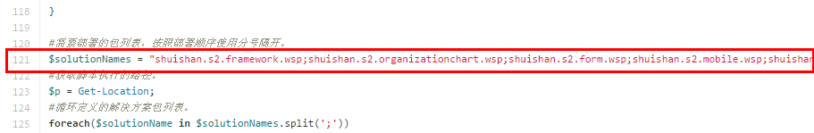
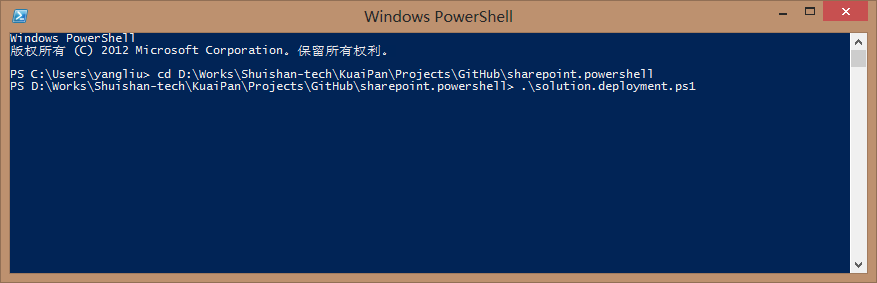

#sharepoint.powershell
> SharePoint管理，开发，测试等方面相关的Powershell脚本集合。

## solution.deployment.ps1
> Sharepoint解决方案包部署脚本。
### 适用版本 
- SharePoint 2010
- SharePoint 2013

### 使用方式
1. 下载脚本[solution.deployment.ps1](solution.deployment.ps1)。
2. 复制`solution.deployment.ps1`脚本到需要部署的解决方案包所在的目录。
3. 修改脚本中第121行中的`$solutionNames`变量值，多个解决方案包使用`分号(;)`隔开。
4. 在Powershell命令行窗口执行`solution.deployment.ps1`。